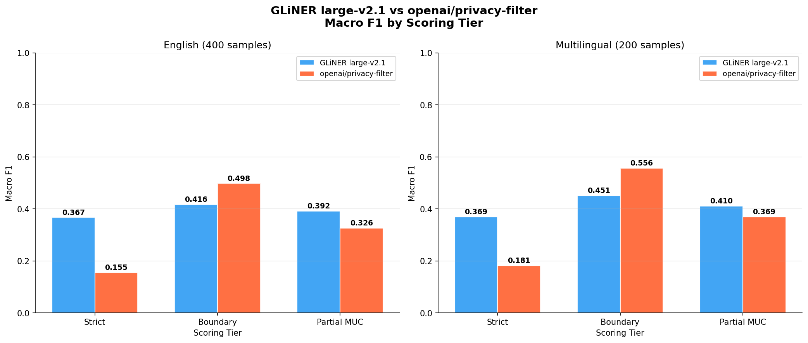

# GLiNER vs openai/privacy-filter: A Rigorous PII Detection Shootout

*How a single prompt to an autonomous AI engineering agent produced a complete, unbiased model evaluation — and what the results actually say.*

---

There are two models on HuggingFace right now that are genuinely interesting for anyone building privacy-aware systems: `urchade/gliner_large-v2.1` and `openai/privacy-filter`. Both detect personally identifiable information in text. Both are open-weight. Both run locally. But they are architecturally very different, and most comparisons you find online either test only one of them or use a metric that quietly favours one architecture over the other.

This post documents a full head-to-head evaluation — 600 samples, six PII categories, three scoring tiers, threshold tuning, English and multilingual sets — run entirely by [Neo](https://heyneo.com), an autonomous AI engineering agent, from a single high-level prompt. The methodology is based on the MUC/SemEval evaluation standard. The results are reproducible. And the conclusion is more nuanced than "model X wins."

---

## The Two Contenders

### GLiNER large-v2.1

GLiNER ("Generalist Model for NER") takes a fundamentally different approach to named entity recognition. Instead of training a classifier for a fixed set of labels, it encodes both the input text and the entity type description into a shared latent space, then scores candidate spans against each entity type embedding. At inference time, you pass whatever labels you want as plain text strings:

```python
from gliner import GLiNER
model = GLiNER.from_pretrained("urchade/gliner_large-v2.1")
entities = model.predict_entities(
    "Alice Smith called from +1-555-0192",
    labels=["person name", "phone number"],
    threshold=0.5
)
```

This zero-shot flexibility is genuinely useful. You are not locked into a fixed taxonomy. If your use case needs `"passport number"` or `"vehicle registration"`, you just add it to the list. The model is about 300M parameters and runs on CPU without drama.

### openai/privacy-filter

OpenAI released this model in April 2025 under Apache 2.0. It started life as an autoregressive GPT-style checkpoint and was converted into a bidirectional token classifier — a pre-norm transformer encoder stack with grouped-query attention and sparse mixture-of-experts feed-forward blocks. The MoE design means only about 50M of its 1.5B parameters are active at any given forward pass, which keeps CPU inference tractable.

It uses a BIES tagging scheme (Beginning, Inside, End, Single) and outputs predictions across eight fixed categories: `private_person`, `private_address`, `private_email`, `private_phone`, `private_url`, `private_date`, `account_number`, and `secret`. You load it like any HuggingFace token classifier, but it requires `trust_remote_code=True` because the model type was added to the transformers dev branch and has not yet landed in a stable release.

```python
from transformers import AutoModelForTokenClassification, AutoTokenizer
tokenizer = AutoTokenizer.from_pretrained("openai/privacy-filter", trust_remote_code=True)
model = AutoModelForTokenClassification.from_pretrained(
    "openai/privacy-filter", trust_remote_code=True, dtype=torch.float32
)
```

---

## Why Most Comparisons Get This Wrong

Before getting to results, it is worth explaining the measurement problem that invalidates naive comparisons between these two model types.

GLiNER outputs character-level spans directly. If it detects a person name from character 12 to character 22, that is exactly what you get.

openai/privacy-filter is a token classifier. Its tokenizer is GPT-style BPE, which adds a leading whitespace to most tokens — `" Alice"` rather than `"Alice"`. When you recover character offsets from the token boundaries, the span starts one character early compared to what a human annotator would write. This is not a bug in the model. It is a systematic property of BPE tokenization.

If you evaluate both models using strict exact character-span matching — which is the obvious first approach — you are penalising openai/privacy-filter for a tokenizer convention, not for actually missing entities. The model found `Alice Smith`. It just reported the span starting at position 11 instead of 12.

The fix is to use a scoring framework that does not require pixel-perfect offset agreement. That is what this evaluation does.

---

## Evaluation Setup

### Dataset

We used `ai4privacy/pii-masking-400k` from HuggingFace — 406K synthetic multilingual entries with character-level PII annotations across 17 label types. We sampled from the validation split only (never the training split) to avoid any data leakage.

**Splits:**
- 50 English samples: held-out dev set for GLiNER threshold tuning only
- 400 English samples: main English evaluation set
- 200 multilingual samples: 40 each from French, German, Spanish, Italian, and Dutch

### Common Label Schema

The two models use different internal taxonomies, so we defined a six-category common schema and mapped both models' outputs to it:

| Category | ai4privacy source labels | GLiNER prompt | openai label |
|---|---|---|---|
| PERSON | GIVENNAME, SURNAME, PREFIX, MIDDLENAME | `"person name"` | `private_person` |
| EMAIL | EMAIL | `"email address"` | `private_email` |
| PHONE | TELEPHONENUM | `"phone number"` | `private_phone` |
| ADDRESS | STREET, CITY, ZIPCODE, STATE, COUNTY | `"street address"` | `private_address` |
| URL | URL | `"url"` | `private_url` |
| DATE | DATE, TIME | `"date"` | `private_date` |

Two openai/privacy-filter categories (`account_number` and `secret`) have no clean equivalent in the ai4privacy gold labels and were excluded from scoring. This keeps the comparison fair — we only score what both models can be held accountable for.

### GLiNER Threshold Tuning

GLiNER's `predict_entities` has a `threshold` parameter that controls the confidence cutoff. We swept five values — 0.3, 0.4, 0.5, 0.6, 0.7 — on the 50-sample dev set and measured strict macro F1 for each:

| Threshold | Macro F1 | PERSON | EMAIL | PHONE | ADDRESS | DATE |
|---|---|---|---|---|---|---|
| 0.3 | 0.3686 | 0.2857 | 0.4211 | 0.5882 | 0.6087 | 0.3077 |
| 0.4 | 0.4023 | 0.3030 | 0.5000 | 0.6667 | 0.6364 | 0.3077 |
| 0.5 | 0.4225 | 0.3175 | 0.5333 | 0.7143 | 0.6364 | 0.3333 |
| 0.6 | 0.4473 | 0.3333 | 0.6667 | 0.7143 | 0.6364 | 0.3333 |
| **0.7** | **0.5022** | **0.3774** | **0.8000** | **0.7692** | **0.6667** | **0.4000** |

Threshold 0.7 wins clearly. The default of 0.5 underperforms by about 8 F1 points on this task. All GLiNER results below use threshold 0.7.

### Three-Tier Scoring

We implemented the MUC/SemEval evaluation framework with three scoring tiers:

**Strict**: A prediction is a true positive only if `(start, end, label)` all match the gold span exactly. This is the most conservative metric and the one that penalises BPE offset drift.

**Boundary**: A prediction is a true positive if the predicted span overlaps the gold span (shares at least one character) and the label matches. This is the fair metric for comparing span-extraction models against token classifiers — it does not care whether the span starts at character 11 or 12.

**Partial (MUC)**: Any character overlap with the correct label earns partial credit. Score = (COR + 0.5 x PAR) / total, where COR is exact matches and PAR is partial overlaps. This is the most lenient tier and the standard used in MUC-style NER evaluation.

---

## Results

### English Evaluation (400 samples)



*Macro F1 across all three scoring tiers for both models on English (left group) and multilingual (right group) evaluation sets.*

#### Macro F1 Summary

| Model | Strict | Boundary | Partial |
|---|---|---|---|
| GLiNER large-v2.1 | **0.3667** | 0.4162 | **0.3915** |
| openai/privacy-filter | 0.1547 | **0.4976** | 0.3261 |

The strict tier tells a misleading story. GLiNER wins 0.3667 to 0.1547 — a gap that looks decisive. But once you switch to Boundary scoring, the picture flips: openai/privacy-filter leads 0.4976 to 0.4162. The entire gap in strict scoring is explained by tokenizer offset drift, not by the model actually missing entities.

#### Per-Category Breakdown (Boundary Scoring, English)

| Category | Gold Spans | GLiNER F1 | OpenAI F1 | Winner |
|---|---|---|---|---|
| PERSON | 148 | 0.6154 | **0.6856** | OpenAI |
| EMAIL | 37 | 0.7294 | **0.9867** | OpenAI |
| PHONE | 26 | 0.5053 | **0.6667** | OpenAI |
| ADDRESS | 97 | **0.3896** | 0.3719 | GLiNER |
| URL | 0 | 0.0000 | 0.0000 | Inconclusive |
| DATE | 15 | 0.2574 | **0.2745** | OpenAI |

openai/privacy-filter wins on four of five conclusive categories under boundary scoring. Its EMAIL performance is particularly striking — 0.9867 F1, essentially perfect boundary detection. GLiNER edges it on ADDRESS, likely because address spans are structurally more complex and the zero-shot label prompt `"street address"` captures them differently than the fine-tuned `private_address` category.

The URL category had zero gold spans in the sampled English set. Both models predicted URL entities (GLiNER: 50 predictions, OpenAI: 38 predictions), but with nothing to match against, F1 is undefined and reported as 0. This is a data sparsity issue, not a model failure.

#### Precision vs Recall

One pattern worth noting: GLiNER has high recall but moderate precision. On PHONE (English), it achieves 0.9231 recall but only 0.3478 precision — it finds almost every phone number but generates a lot of false positives alongside them. openai/privacy-filter is more conservative in what it flags, which hurts recall but improves precision.

This matters for your use case. If you are building a redaction pipeline where missing a phone number is worse than over-redacting, GLiNER's recall profile is attractive. If you are building something where false positives cause downstream problems (e.g., redacting non-PII text that breaks document structure), openai/privacy-filter's precision is preferable.

---

### Multilingual Evaluation (200 samples: FR/DE/ES/IT/NL)

| Model | Strict | Boundary | Partial |
|---|---|---|---|
| GLiNER large-v2.1 | **0.3695** | 0.4508 | **0.4101** |
| openai/privacy-filter | 0.1813 | **0.5559** | 0.3686 |

openai/privacy-filter's advantage under Boundary scoring is actually larger on multilingual text (0.5559 vs 0.4508) than on English (0.4976 vs 0.4162). This is counterintuitive given that the model's own documentation flags non-English performance as a risk area. Looking at the per-category numbers explains why:

| Category | Gold Spans | GLiNER F1 | OpenAI F1 | Winner |
|---|---|---|---|---|
| PERSON | 76 | 0.6957 | **0.6994** | OpenAI (marginal) |
| EMAIL | 23 | 0.7170 | **1.0000** | OpenAI |
| PHONE | 17 | 0.5161 | **0.6800** | OpenAI |
| ADDRESS | 42 | 0.3188 | **0.5376** | OpenAI |
| URL | 0 | 0.0000 | 0.0000 | Inconclusive |
| DATE | 9 | 0.4571 | **0.4186** | GLiNER |

Email addresses and phone numbers are structurally similar across languages — they follow recognisable patterns regardless of locale. openai/privacy-filter achieves perfect boundary recall on EMAIL in the multilingual set (1.0000) and perfect recall on PHONE (1.0000). These are categories where the model's fine-tuning on pattern recognition pays off across language boundaries.

GLiNER holds its own on PERSON and edges ahead on DATE, where the diversity of date formats across languages (French `"15 mars 2024"`, German `"15. März 2024"`) may benefit from the zero-shot label prompt approach.

---

## What the Three Tiers Actually Tell You

The gap between strict and boundary F1 is the single most informative number in this evaluation. Here is what it looks like for each model:

| Model | Strict F1 (EN) | Boundary F1 (EN) | Gap |
|---|---|---|---|
| GLiNER large-v2.1 | 0.3667 | 0.4162 | +0.0495 |
| openai/privacy-filter | 0.1547 | 0.4976 | **+0.3429** |

GLiNER's strict and boundary scores are close together. This makes sense — it outputs character spans directly, so its spans either match exactly or they do not. The small gap reflects genuine partial overlaps.

openai/privacy-filter's gap is enormous: 0.3429 F1 points. Almost all of its "failures" under strict scoring are actually correct detections with a one-character offset. If you had evaluated this model using only strict matching — which is what most quick benchmarks do — you would have concluded it was dramatically worse than GLiNER. The actual difference in detection quality is much smaller, and on boundary scoring, it is the better model.

This is why evaluation methodology matters. A single metric choice can reverse the conclusion of a comparison.

---

## Practical Guidance

**Use openai/privacy-filter if:**
- You need high-precision detection of the eight categories it covers
- EMAIL, PHONE, and PERSON are your primary targets
- You want a model you can fine-tune on domain-specific data (it is a standard token classifier)
- You are working across multiple European languages

**Use GLiNER large-v2.1 if:**
- You need custom PII categories beyond the standard eight
- Recall matters more than precision (safety-critical redaction)
- You want zero-shot flexibility to adapt the taxonomy at runtime without retraining
- You need to detect entity types that are domain-specific or unusual

**For production systems:**
Both models run on CPU. openai/privacy-filter is faster in practice (~2.8 samples/sec vs ~1.1 samples/sec for GLiNER large on CPU) because its MoE architecture keeps active parameters low. If throughput is a constraint, that matters.

Neither model should be used as the sole gate for compliance-critical anonymisation. Both miss entities and both generate false positives. The right architecture for compliance use cases layers model output with rule-based post-processing and human review.

---

## How Neo Built This

This entire evaluation — from a blank project directory to a complete, reproducible pipeline with threshold tuning, three-tier scoring, multilingual testing, and this report — was produced by [Neo](https://heyneo.com) from a single high-level prompt.

[Neo](https://heyneo.com) is an autonomous AI engineering agent that works inside your VS Code or Cursor IDE. You give it a goal. It researches the problem, plans the implementation, writes the code, runs it, debugs failures, and iterates until the work is done. No scaffolding. No hand-holding.

For this evaluation specifically, Neo:

1. **Researched both models** — fetched model cards, verified the BIES tagging scheme, confirmed the `trust_remote_code=True` requirement for openai/privacy-filter, identified the BPE offset drift problem before writing a single line of evaluation code
2. **Identified the measurement bias** — recognised that strict exact-match scoring would systematically penalise the token classifier and designed the three-tier framework to address it
3. **Built the full pipeline** — dataset loading with label mapping, GLiNER threshold sweep, inference scripts for both models, the three-tier evaluator, and the report generator
4. **Debugged real failures** — the ai4privacy dataset has empty `id` fields for all samples, which caused the first evaluator to collapse all predictions into a single dict entry. Neo caught this, diagnosed it, and fixed it with positional matching
5. **Produced all artefacts** — prediction files, metrics CSVs, the comparison chart, and this report

The evaluation ran entirely on CPU (no GPU available in the sandbox). Total wall-clock time was roughly 45 minutes for the full 600-sample run.

### Extending This Work with Neo

The pipeline is modular and all scripts are in `src/`. If you want to build on this evaluation, clone the repo and give Neo a follow-up prompt:

```bash
git clone https://github.com/gauravvij/pii-filter-model-eval.git
cd pii-filter-model-eval
```

Then open the project in VS Code or Cursor with Neo installed, and try prompts like:

- *"Add GLiNER medium-v2.1 and knowledgator/gliner-pii-small-v1.0 to the evaluation and compare all three models side by side"*
- *"Add a per-language breakdown to the multilingual results — show F1 for French, German, Spanish, Italian, and Dutch separately"*
- *"Run inference speed benchmarking on CPU — samples per second for each model — and add it to the report"*
- *"Swap the dataset for a real-world sample of support ticket text and re-run the full evaluation"*
- *"Wire this into a CI pipeline that re-runs the evaluation on a schedule and alerts if F1 drops more than 5 points"*
- *"Fine-tune GLiNER on the ai4privacy training split and evaluate the fine-tuned checkpoint against openai/privacy-filter"*

Neo will read the existing code, understand the pipeline structure, and extend it — no manual setup required.

---

## Reproducing This Evaluation

The full pipeline is open and reproducible. See the [README](README.md) for setup instructions.

```bash
git clone https://github.com/gauravvij/pii-filter-model-eval.git
cd pii-filter-model-eval
python -m venv venv && source venv/bin/activate
pip install gliner datasets pandas matplotlib tqdm
pip install git+https://github.com/huggingface/transformers.git  # dev branch required for openai/privacy-filter

python src/load_dataset_v2.py
python src/tune_gliner_threshold.py
python src/run_gliner_v2.py
python src/run_openai_filter_v2.py
python src/evaluate_v2.py
python src/generate_report_v2.py
```

Results land in `results/`. The full metrics are in `metrics_en.csv` and `metrics_ml.csv`. The chart is `f1_comparison_v2.png`.

---

## Limitations

A few things this evaluation does not cover:

- **Inference speed benchmarking** — we ran on CPU without timing. GPU throughput comparison would be a useful addition.
- **Real-world data** — ai4privacy is synthetically generated. Real PII in production text (emails, support tickets, medical notes) has different distribution and noise characteristics.
- **URL category** — zero gold URL spans appeared in the sampled sets. Both models predict URLs but there is nothing to score against. A targeted URL-heavy sample would be needed to evaluate this category.
- **Fine-tuned GLiNER variants** — there are domain-specific GLiNER variants (e.g., `knowledgator/gliner-pii-small-v1.0`) that might perform differently on this task. This evaluation covers only the base large-v2.1 checkpoint.
- **openai/privacy-filter `account_number` and `secret`** — these two categories were excluded because the ai4privacy dataset has no equivalent gold labels. A dataset with financial or credential data would be needed to evaluate them.

---

*All code, data, and results for this evaluation are in this repository. The pipeline was built and run by Neo.*
